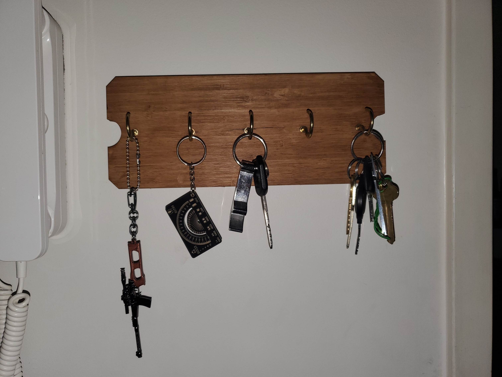
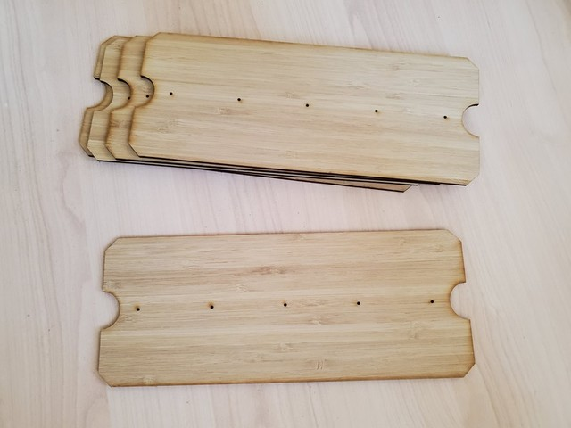
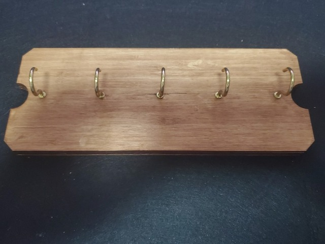
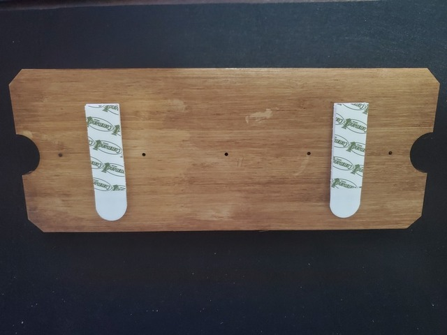
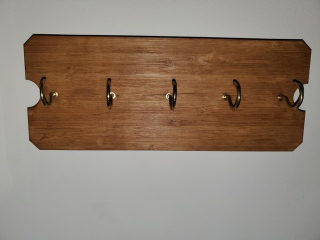
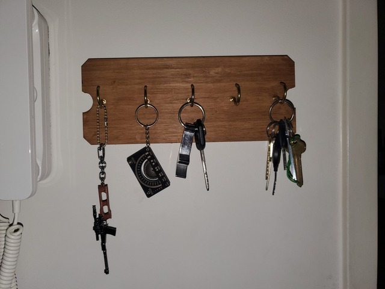

Key rack
========

A key rack to go on the wall near my door.

## Construction method

| Photo                                                                        | Description                                                                                                                                                                                                                                                                                                                                                         |
| ---------------------------------------------------------------------------- | ------------------------------------------------------------------------------------------------------------------------------------------------------------------------------------------------------------------------------------------------------------------------------------------------------------------------------------------------------------------- |
|  | I got [Ponoko](https://make.ponoko.com) to laser cut the basic shape out of their 3mm thick [amber bamboo plywood](https://www.ponoko.com/materials/amber-bamboo-plywood). 3mm is not going to be thick enough for the screw in hooks, but I can glue multiple pieces together. I got 5 pieces made but only needed to use 4 of them to get the board thick enough. |
|  | I stained the wood with  and stuck five screw in hooks into the 5 little holes.                                                                                                                                                                                                                                                                                     |
|  | I put some some double sided tape on the back ...                                                                                                                                                                                                                                                                                                                   |
|  | ... and stuck the whole thing to the wall.                                                                                                                                                                                                                                                                                                                          |
|  | Done. Time to hang some stuff.                                                                                                                                                                                                                                                                                                                                      |
