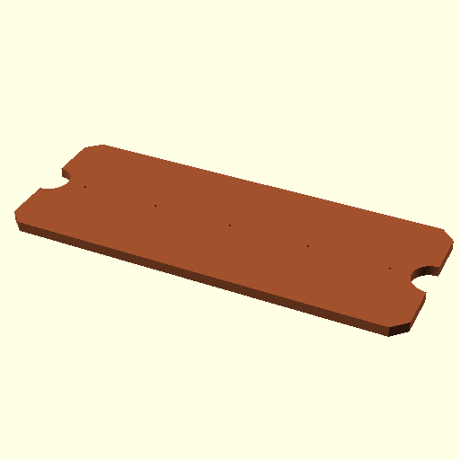

Key rack
========

A key rack to go on the wall near my door.

I'll probably get [Ponoko](https://make.ponoko.com) to laser cut the basic shape out of their [walnut hardwood](https://make.ponoko.com/materials/walnut-hardwood), maybe run it around a router to make the edges look pretty, stick some screw in hooks into the 5 little holes in the wood and stick the whole thing to the wall with some double sided tape.
